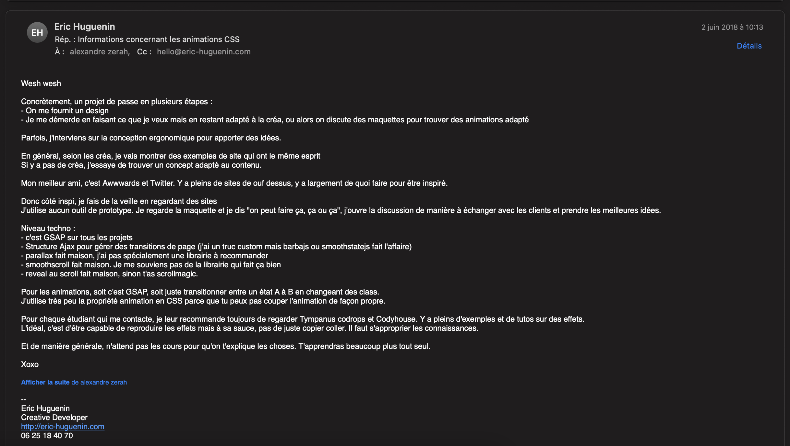

# Cours creative dev

## Qu'est-ce que le creative dev ?
> "Etudie le passé si tu veux comprendre le futur" - Confucius.
    
L'Internet grand public arrive au début des anneées 1990.
   - 1990 : Premier navigateur web sur un Ordinateur Next (info.cern.ch) 
   - 1991 : Naissance du World Wide Web (par Tim Berners-Lee)
   

## Animations web
### Bibliothèques
- [Barba.js](https://barba.js.org/)
- [locomotiveScroll](https://github.com/locomotivemtl/locomotive-scroll)
- [Tone.js](https://tonejs.github.io/)
- [P5.js](https://p5js.org/)

### Application et API
- [Webgl](https://www.khronos.org/webgl/)
- [WebGPU](https://surma.dev/things/webgpu/)

### Technos
- CSS 
  - flex
  - grid
  - Transition
  - Animation
- JS
  - event Listener
    - scroll
    - MouseEvent
    - PageTransitionEvent
    - WheelEvent
    - TransitionEvent
- Canvas
- SVG
- AR / VR

### Langage
- [Processing](https://processing.org/)

### Low code / No code
- [Webflow](https://webflow.com/)
- [Semplice](https://www.semplice.com/)
- [Carbonmade](https://carbonmade.com/)
- [Cargo](https://cargo.site/)

### Tutoriels et code
- [Codrops playground](https://tympanus.net/codrops/category/playground/)
- [Codegrid](https://www.youtube.com/c/Codegrid?app=desktop)

### Inspiration / Récompenses et veilles
- [Awwwards](https://www.awwwards.com/)
- [FWA](https://thefwa.com/)
- [Dribbble](https://dribbble-com)
- [Codepen](https://codepen.io/)

### Ressources
- [Images : Unsplash](https://unsplash.com/)
- [Google Fonts](https://fonts.google.com/about)
- [Coolors](https://coolors.co/)

### Articles
- [Article WebGL](https://www.wonderstudios.com/blog/agence-digitale-creative/futur-webgl-et-gaming/)

### Lieux
- [Les Gobelins](https://www.gobelins.fr/formation/mdi-design-et-management-de-l-innovation-interactive-option-lead-technique-ou-lead-creatif)

### Agences
- [Immersive Garden](https://immersive-g.com/)
- [Locomotive](https://locomotive.ca/fr)
- [Immersive garden](https://www.hellomonday.com/)
- [Watson](https://watson.la/)
- [Fcinq](https://www.fcinq.com/)

### Personnes
- [Benjamin Code](https://www.youtube.com/c/BenjaminCode) : développeur front-end et Youtubeur 🇫🇷
- [Kevin Powell](https://www.kevinpowell.co/) : Maitre du CSS
- [Aristide Benoist](https://www.aristidebenoist.com/) : Maître incontesté du creative dev 🇫🇷
- [Antoine Boulanger](https://antoineboulanger.com/) : Front-end Engineer
- [Antoine Wodniack](https://wodniack.dev/#about/)
- [David Perozzi](Creative developer)
- [Eric Huguenin](https://erichuguenin.com/)
- [Florent Biffi](https://florentbiffi.com/)
- [JCS](https://www.jcsuzanne.com)
- [Luigi de rosa](https://luruke.com/)
- [Léo Chéron](https://leo.cheron.works/)
- [Julio César](https://www.juliocesar.work/)
- [Michael Garcia](https://www.michaelg.fr/)
- [Rob Smittenaar](https://robsmittenaar.com/)
- [Romain Avalle](https://www.romainavalle.dev/)
- [Tobias Van Schneinder](https://vanschneider.com/) : Creative director de Desk / Cofondateur de Semplice et Mymind 

## Réponse à un mail




## Distinction Développement / Design

Les sites creative dev sont une aliance du design et du développement.
Ici nous nous intéressons avant tout à la partie **développement**.

Mais il faut garder à l'esprit qu'un bon site nécessite un bon design (vous ou un/des designer/s)

## Code

### Vanilla

- `document.querySelector`
- `addEventListener()`
- `css`

```css
#element {
    transition: 3s;
}
```

```javascript
const el = document.querySelector("element");
el.style.transform = "translateX(200px)";
```

[Code vanilla JS](./files/0-vanilla)

Questions :
- Comment faire un revert d'animation ?
- Comment gérer l'accéleration des animations ?
- Peut-on arreter l'animation en cours ?

### Solution professionnelle : GSAP

[GSAP CORE](./modules/GSAP-core.md)
